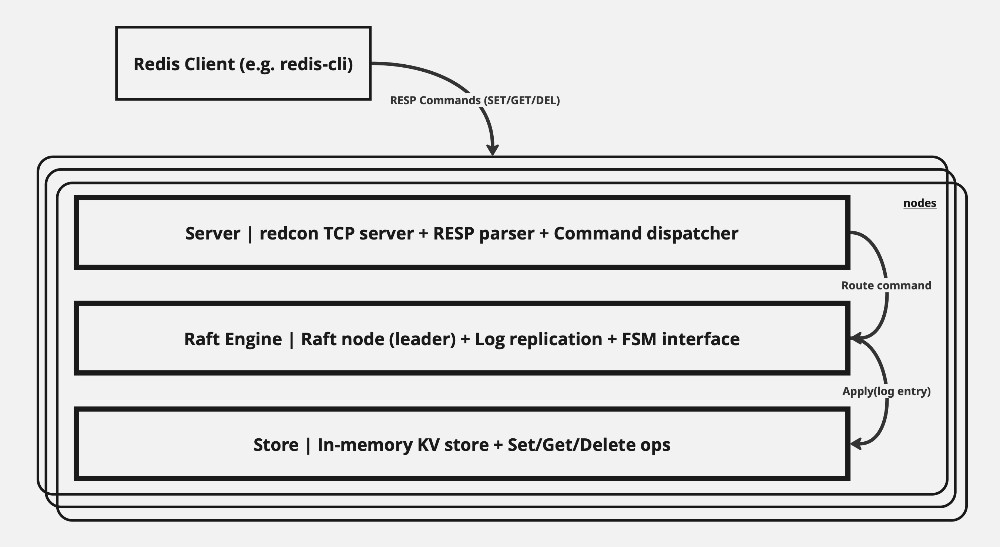

# DESIGN.md

## Redraft: System Architecture

### Overview

Redraft is a minimal, Redis-compatible, distributed key-value store built in Go. It uses the Redis wire protocol for client communication and the Raft consensus algorithm to replicate state across nodes.

This document outlines the system’s architecture, key modules, design decisions, tradeoffs, and future extensibility.

---

## Goals

- Provide a simple but correct distributed key-value engine
- Ensure strong consistency for write operations using Raft
- Support client interaction using a Redis-compatible interface
- Maintain modularity and separation of concerns for clarity and extensibility

---

## System Structure

Redraft is composed of three primary modules:

### 1. Server (Redis Protocol + Command Routing)

**Responsibilities:**
- Implements the Redis protocol using `redcon`
- Accepts connections from Redis clients
- Parses and validates incoming RESP commands
- Routes write commands (`SET`, `DELETE`) to the Raft engine
- Routes read commands (`GET`) directly to the local store

### 2. Raft Engine

**Responsibilities:**
- Bootstraps and manages a local Raft node using `hashicorp/raft`
- Handles log replication and leader election
- Applies committed log entries through a deterministic FSM
- Ensures consistency of state across all cluster members

> See initial [Raft library evaluation](https://github.com/your-repo/issues/1) for comparison and rationale behind selecting `hashicorp/raft`.

### 3. Store (State Backend)

**Responsibilities:**
- Provides in-memory key-value storage
- Applies operations forwarded by the FSM (e.g., `SET`, `DELETE`)
- Supports basic `Set`, `Get`, and `Delete` interfaces
- Can be replaced with persistent storage in future iterations


Below is a high-level diagram of the architecture.



---

## Command Flow

Example: `SET foo bar`

1. Client sends `SET foo bar` to the Redis server over TCP.
2. The Redis server parses the command and passes it to the dispatcher.
3. If the node is the Raft leader:
   - The command is encoded into a Raft log entry.
   - Raft replicates the entry to all peers.
   - Once committed, the FSM applies the operation to the local store.
4. Followers receive the same log entry and apply it through their FSM.

Read operations (`GET`) are handled directly from the local store without Raft involvement.

---

## Raft FSM Interface

Each committed operation is expected to follow a standard encoded format. The FSM decodes the command and applies it deterministically.

```go
type Command struct {
    Op    string // "set", "delete"
    Key   string
    Value []byte
}
```

Only the FSM is allowed to mutate the store to preserve log consistency and determinism.

---

## Tradeoffs

- In-memory store only; no durability across restarts  
- Static 3-node cluster configuration  
- No log snapshotting or compaction  
- No client redirection for non-leader writes  
- Simplified error handling and bootstrapping  

These are deliberate constraints chosen to keep the system focused and shippable within limited implementation time. Each represents a well-defined opportunity for future iteration.

---

## Extensibility

The architecture is intentionally modular and can support the following enhancements without significant restructuring:

| Extension                            | Target Module     |
|--------------------------------------|-------------------|
| Disk-backed storage                  | Store             |
| Raft snapshot and restore            | Raft Engine       |
| Cluster introspection commands       | Server            |
| Multi-key commands                   | Server + FSM      |
| TTLs, metadata support               | Store + FSM       |
| Dynamic cluster membership           | Raft Engine       |
| gRPC or HTTP API layer               | New module        |
| Blockchain or DAG backend integration| FSM or Store      |

---

## Summary

Redraft is designed around a clear, three-module structure:

- The **server** module handles protocol and client interactions  
- The **raft** module coordinates distributed state through consensus  
- The **store** module manages local state transitions  

This separation ensures each module is testable, replaceable, and extendable. It creates a foundation that can evolve into a more advanced system while staying understandable and correct at each step.
